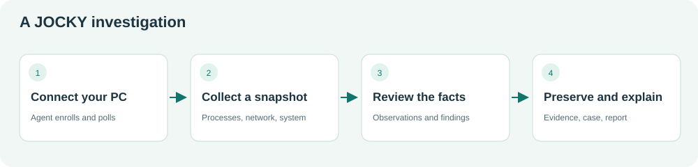
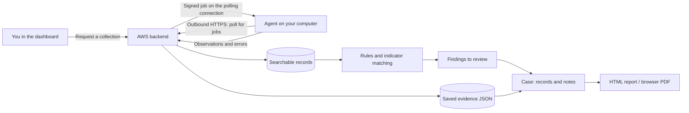
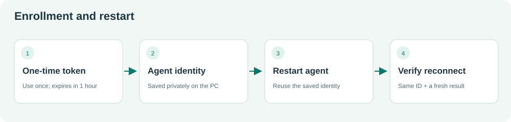
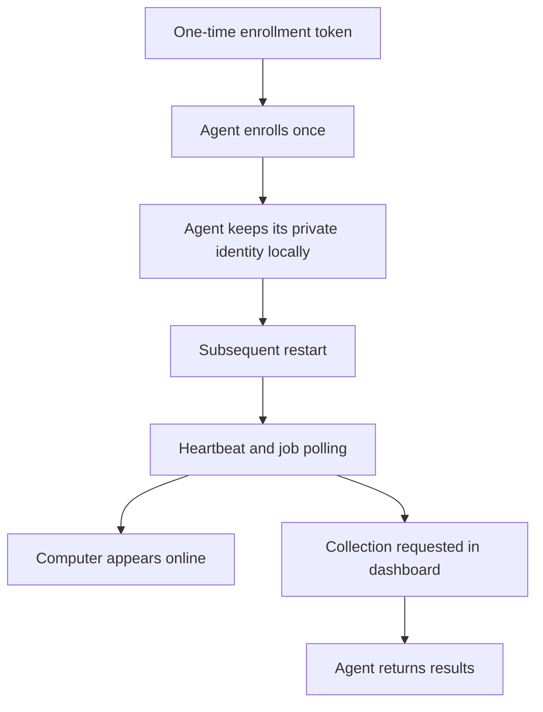
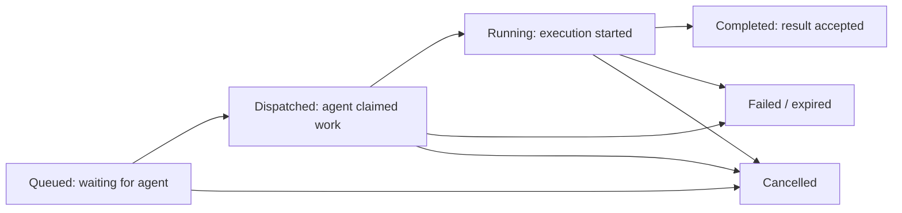
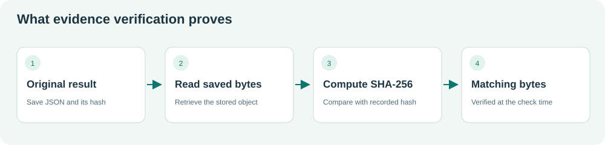
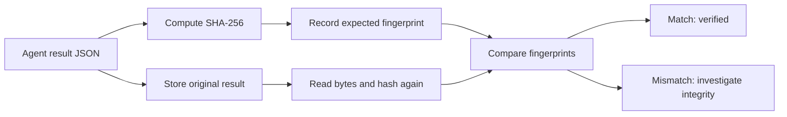
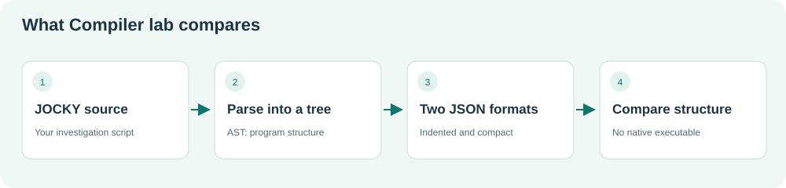
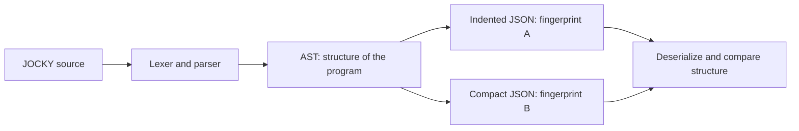

# JOCKY — your dashboard handbook

**Audience:** someone using JOCKY for the first time.  
**Guide and interface revision:** 16 September 2026 · JOCKY 0.1.0.  
**Start here:** [Your first investigation](#your-first-investigation--follow-this-in-order).  
**Private illustrated copy:** `.local/guide/JOCKY-HANDBOOK.md`, with screenshots beside it. The screenshots show the local lab, not the AWS database. They contain real saved lab records and are deliberately excluded from Git. The downloadable local ZIP keeps the handbook and pictures together.

> **The simplest explanation:** JOCKY asks a small program on a computer to collect permitted information, saves the results, highlights matches worth reviewing, and helps you document what you found. It is a defensive investigation prototype. It does not automatically remove malware, block a network connection, or isolate a computer.

## Contents

1. [What exists in this project](#what-exists-in-this-project)
2. [The words you need](#the-words-you-need)
3. [How the pieces connect](#how-the-pieces-connect)
4. [Navigation and common controls](#navigation-and-common-controls)
5. [Overview](#1-overview)
6. [Computers](#2-computers)
7. [Collections](#3-collections)
8. [Findings](#4-findings)
9. [Cases](#5-cases)
10. [Timeline](#6-timeline)
11. [Indicators](#7-indicators)
12. [Evidence](#8-evidence)
13. [Reports](#9-reports)
14. [Detection rules](#10-detection-rules)
15. [Script studio](#11-script-studio)
16. [Compiler lab](#12-compiler-lab)
17. [AI assistant](#13-ai-assistant)
18. [Activity log](#14-activity-log)
19. [Settings](#15-settings)
20. [Your first investigation](#your-first-investigation--follow-this-in-order)
21. [How to prove it works](#how-to-prove-it-works)
22. [Roles](#who-can-do-what)
23. [Troubleshooting](#troubleshooting)
24. [Project files and current limits](#where-the-code-lives)

## What exists in this project

| Part | What it does | Where it runs |
|---|---|---|
| Browser dashboard | The 15 pages described below; sends requests and displays results | Your browser |
| Next.js web server | Serves the interface and forwards authenticated browser requests | AWS server; also available in the separate Mac development lab |
| FastAPI backend | Checks permissions, queues jobs, processes results, handles rules, cases and reports | AWS server |
| Rust agent | Enrolls once, checks for jobs, collects permitted information, sends results back | Each computer being investigated |
| PostgreSQL | Stores users, endpoints, jobs, observations, findings, cases and metadata | Server container |
| MinIO | Stores collection evidence objects | Server container |
| Redis | Supports event notifications and rate limiting | Server container |
| Caddy | Provides the public HTTPS entry point and routes requests | AWS deployment |
| JOCKY language | A small, bounded language for read-only investigation queries | CLI and agents; validation also uses the server CLI |
| Optional AI / YARA | Assistance from a configured model / pattern scanning of selected saved evidence | Only when separately configured |

**Local and cloud are different workspaces.** `http://127.0.0.1:3100` is the Mac lab. `https://jocky-lab.duckdns.org` is the AWS workspace. Records and credentials in one do not automatically appear in the other. An agent sends data to the server URL in its configuration. The screenshots in this handbook use the local lab so that a redesign can be tested before publishing it to AWS.

**Redesign deployment:** the new dashboard was published to the existing AWS service on 16 September 2026; HTTPS/authentication/API checks passed and the new interface was observed in the public browser. See [redesign validation and testing limits](dashboard-redesign-validation.md).


**What has previously worked on AWS:** a real Mac and one real Windows PC completed the foreground collection workflow. Windows restart reused its enrolled identity. The second Windows PC, Windows background-service acceptance, optional AI, optional YARA and backup restoration still need testing. See [dated verification details](STATUS.md); these are historical tests, not a promise that an agent is online now.

## The words you need

| Word | Plain explanation | Example |
|---|---|---|
| Endpoint / computer | A machine with an enrolled JOCKY agent | Your Windows PC, Vatsa |
| Agent | The small program doing the collection on that machine | `jocky-agent.exe` |
| Enrollment | Registering an agent with the server | Paste a one-time token into the launcher |
| Collector | Code that reads one category of system information | Process inventory |
| Job / collection | A request asking one or more agents to do work | Quick scan of Vatsa |
| Target | One computer's share of a job | A two-computer job has two targets |
| Observation | One stored fact returned by a collector | A process name, PID and parent |
| PID | Operating-system process identifier; can be reused over time | Process 4820 |
| Finding / detection | A record produced by a rule, indicator match or script alert | “JOCKY DEMO: our own agent was observed” |
| Indicator / IOC | A value to compare with collected fields | Exact filename `jocky-agent.exe` |
| Evidence object | Saved JSON collection output, with a recorded fingerprint | The result of one quick collection |
| SHA-256 | A fingerprint computed from bytes | A 64-character hexadecimal hash |
| Custody | Recorded actions concerning an evidence object | Upload, verification, download, attachment |
| Case | A folder of related records and investigator notes | “Windows PC 1 verification” |
| Report | A saved HTML snapshot describing a case | Open it and print to PDF |
| Provenance | Where a fact came from | Computer, collector, job, source and timestamp |
| AST | Abstract syntax tree: a structured representation of code | A `hunt` containing a process query |
| JSON | A structured text format with field names and values | `{"name":"jocky-agent.exe"}` |

## How the pieces connect





The agent initiates its connection. You do not open an inbound port on the Windows PC for JOCKY. The browser does not collect Windows data itself. Closing the **foreground** agent window stops that agent until you start it again.





“Started without a token” means the launcher reused the saved identity. To prove the entire path works, also check the same endpoint ID, a recent last-seen time and a newly completed collection. It does **not** demonstrate automatic startup after a Windows reboot.

## Navigation and common controls


### New names versus the earlier dashboard

Some backend/API names remain unchanged. This mapping helps you follow older instructions.

| Sidebar group | New page name | Earlier label / API concept |
|---|---|---|
| Workspace | Overview | Command Center |
| Workspace | Computers | Endpoints |
| Workspace | Collections | Investigations / jobs |
| Investigate | Findings | Detections |
| Investigate | Cases | Cases |
| Investigate | Timeline | Incident timeline |
| Investigate | Indicators | Indicators / IOC |
| Evidence & reports | Evidence | Evidence |
| Evidence & reports | Reports | Reports |
| Advanced tools | Detection rules | Rules |
| Advanced tools | Script studio | JOCKY Playground |
| Advanced tools | Compiler lab | Compiler Lab |
| Advanced tools | AI assistant | AI Investigator |
| Administration | Activity log | Audit Logs |
| Administration | Settings | Settings |

- **Sign in:** use the credentials for the specific workspace. The default email field is a convenience, not a valid password. Keep passwords and tokens out of notes and screenshots.
- **Find a page:** searches sidebar names, including the old names. It does not search evidence. Clear it to restore all navigation items.
- **Sidebar toggle:** collapses the menu. Small screens start with the menu closed; open it, choose a page, and it closes again.
- **How to use…:** expand the help strip on any page for three steps and an important limitation.
- **Live stream:** a WebSocket is connected for notifications. **Polling · 10s:** the browser refreshes data periodically. Neither label proves every endpoint is online.
- **Role at the top / account at the bottom:** show the signed-in user's access level and email. The door icon signs out.
- **Green success message:** the API accepted an action. For a collection, “queued” is not the same as “results received.”
- **Red error:** read it before continuing. It may mean missing permissions, invalid input, unavailable services or expired credentials.
- **Refresh behavior:** queries generally refresh every ten seconds and after actions. You do not need to repeatedly click Run.
- **Inspect / clickable row:** opens record details. Plain fields appear first; expand **Complete record (JSON)** for nested observations and metadata. Use **Close** or Escape. Clickable rows also open with Enter or Space; the dialog holds keyboard focus until closed.
- **Short IDs:** tables often show the first eight characters for readability. Open the record to see the complete ID. Similar short IDs do not prove two records are identical.
- **Dates:** timestamps are displayed using your browser's locale/time zone. Compare full dates as well as times.
- **Tables:** on a narrow screen, wide tables scroll horizontally inside their panel.
- **Filters:** page search boxes filter the records already fetched. They are not an unlimited database search.
- **Selected computer:** several investigation pages share this choice while you move between them. Always check the target before Run. Refreshing the browser resets the current UI state and unsaved drafts.


## 1. Overview


**Use it for:** deciding your next action and getting a quick workspace summary.

| Item | Meaning / action |
|---|---|
| Collect data | Opens Collections; it does not immediately send a job |
| Platform operational | The backend health response reports healthy |
| Service status | Opens Settings for individual service status |
| Connect → Collect → Review → Document | Four navigation shortcuts to Computers, Collections, Findings and Cases |
| Enrolled computers | Registered-computer count; the smaller caption tells you how many are online |
| Findings to review | Findings currently `new` or `investigating` in the fetched list |
| Open cases | Cases still being tracked as open work |
| Evidence objects | Number of saved evidence records; it does not mean all were individually verified |
| Your computers | Preview of up to five computers; click a row to inspect it |
| Risk distribution | Computers grouped by calculated risk; it is not a probability of compromise |
| Recent findings | Preview of five detections; click for record details |
| Collection activity | Recent jobs; inspect the full job in Collections for all targets |
| Start investigating | Opens Collections |

**Example:** your computer is offline but has 20 saved findings. You can still read the old findings. Start the agent and collect again before treating them as current activity.

**Success:** the expected hostname is present, data loads without an error, and the last-seen time updates while its agent runs. A green platform banner proves server health, not agent health.

## 2. Computers


**Use it for:** enrollment, identifying a machine, and exploring its stored observations.

### Enroll a new computer

1. As Admin, click **Enroll endpoint**. “Endpoint” means computer.
2. The server creates a token for one use, expiring after one hour.
3. Keep the response private. Paste that token into the intended computer's launcher.
4. Keep the foreground agent running. Its hostname should appear here.
5. Use a different token for a second PC. Do not copy the first PC's saved agent identity.

Do not re-enroll just because the foreground agent was stopped. Starting the same launcher with its existing saved identity should reuse it.

### Computer columns

- **Hostname:** name reported by the computer.
- **OS / architecture:** Windows/macOS/Linux and hardware family, such as x86_64.
- **User:** user information reported at enrollment/heartbeat; not an exhaustive list of all users.
- **Connection IP:** connection address recorded by the server. Behind a reverse proxy this can be the proxy/container address, not the Windows PC's public IP.
- **Status:** online/offline derived from recent communication. Check the timestamp too.
- **Risk:** score out of 100 derived from active findings. It is a prioritisation aid, not a percentage chance of infection.
- **Agent:** reported software version; it does not confirm a signed build or background-service installation.
- **Last seen:** the latest agent contact recorded by the server.

Search hostname, OS, user or IP; select a row. **Identity & risk** opens the full computer record, including risk context. **Quick scan** queues a new system/process/network collection for that computer.

### Data tabs under a selected computer

| Tab | What you can inspect | What an empty tab means |
|---|---|---|
| Processes | Process names, PIDs, parents and available metadata | No stored rows for this scope; collect first |
| Network | Connection addresses, ports, state and available PID | No stored connections; not proof of no network activity |
| System | OS, CPU, memory, disks, uptime and interfaces | System collector has not produced data here |
| Files | Metadata / hashes from explicit permitted paths | Quick scan does not collect files |
| Persistence | Supported startup/service/task configuration | Coverage depends on OS and permissions |
| Drivers | Driver/module inventory where supported | Not proof that every driver is trusted |
| Events | A bounded set of accessible system events | Not a complete historical event archive |
| Scripts | `finding` records returned by scripts | Run a script with `report` or `alert` first |
| Relationship graph | Process-parent / network relationships from a single collection job | Requires usable results from a collection |

**Changing a tab does not start a scan.** Observation rows show name, abbreviated ID, detail, source collector and collected time. **Inspect** opens the complete record. **Previous / Next** page through batches of 100.


The graph displays at most **180 nodes**, even if more are available. Use its zoom/fit controls, pan the canvas, and click a node for its observation. It is a view of one job, not an all-time attack graph; missing nodes can be caused by the display limit.

**Example:** to see Windows startup mechanisms, run a **persistence** collection in Collections, wait for the result, return here, select that PC, then open Persistence.

## 3. Collections


**Use it for:** fresh data collection and tracking what happened to a request.

1. Choose the intended computer. **All enrolled computers** sends one target to every eligible, non-demo, enabled endpoint; confirm that scope before clicking Run.
2. Choose the collection type below.
3. For Files, enter an explicit path permitted by the agent.
4. Click **Run collection** once.
5. Watch the job queue. Inspect the result for **each target**, observation counts and errors.

| Type | What this implementation collects |
|---|---|
| quick | System + processes + network; best first check |
| system | Basic machine and resource metadata |
| process | Current process inventory |
| network | Current connection inventory; no packet capture |
| deep | System, processes, network, persistence, drivers and events; not a full disk/memory forensic image |
| files | Bounded metadata/hashes from an explicit allowed path; not arbitrary whole-file acquisition |
| persistence | Supported OS startup/service/task sources |
| driver | Driver/module inventory; name-based review signals have limited confidence |
| event | Bounded accessible OS event records |
| ioc | Fresh system/process/network data, which the server can match against indicators and rules |
| script | Created through Script studio; executes its bounded read-only query on the selected agent |

The default file access scope is deliberately restricted. Server configuration does not grant the agent permission to read arbitrary folders. A file collector can fail due to its allowed-path restriction, a nonexistent path or OS permissions. Directory operations are bounded and skip symlinks; see [language limits](jocky-language.md).



This is a simplified lifecycle; targets have leases and retries. A multi-computer job can have different target states at the same time. Jobs expire after one hour. A disconnected machine cannot return results until it communicates again, and late results may no longer be accepted.

**Queue columns:** ID identifies the job; kind identifies the collector; target-state badges show progress; result counts show returned observations; Created is the request time. **Inspect** opens parameters, target information and results. **Cancel** is available for eligible active jobs. Cancellation stops acceptance/dispatch of cancelled work; do not assume it instantly kills an already-running OS read on the endpoint.

The lower observation browser lets you select a data category and inspect saved rows. Its computer filter follows the selected scope; the all-computers choice shows observations across computers. The job list is capped at **100**; this is not an unlimited job-history search.

**Success is not a fixed number of rows.** Compare the selected machine, new timestamps, an accepted result, expected categories, and collector errors. An empty successful query can be valid; a successful Quick scan normally includes a system observation.

## 4. Findings


**Use it for:** reviewing a rule match or alert and deciding whether it matters.

- **Filter:** search the fetched findings by values such as severity, endpoint ID, rule or status.
- **Severity:** informational/low/medium/high/critical labels assigned by the source of the finding.
- **Finding title:** open it to inspect the record, explanation and references.
- **Computer:** connects it to the endpoint being reviewed.
- **Risk points:** contribution to prioritisation. Active contributions are summed and capped; they are not calibrated probabilities.
- **Status:** change it using the dropdown. The change is saved immediately if your role permits it.
- **Time:** when the finding was recorded.

| Status | When to use it |
|---|---|
| new | It has not been reviewed yet |
| investigating | You are checking context and supporting records |
| resolved | You have completed the response/review and recorded your conclusion |
| false_positive | The matching condition did not indicate the concern it was meant to detect |

Resolving a finding does not delete evidence or terminate a process. Up to 500 findings are fetched. A zero here means no findings in the displayed scope, not “this computer is safe.”

**Example:** the demo script finds JOCKY's own process. That is an intentional benign self-match. Describe it as a test, attach it to a test case and record the conclusion. Do not present it as a discovered infection.

## 5. Cases


**Use it for:** keeping an investigation understandable to someone else.

### Create and open

Enter a **title**, a **description/question**, and **severity**, then **Create case**. Example: title `Windows PC 1 — collection validation`; description `Confirm that the agent can return processes and preserve evidence. This is a benign test.` Open the case from its row.


### Inside a case

| Control | What it does |
|---|---|
| Status | Saves open / investigating / contained / resolved / closed |
| Generate report | Creates an HTML report snapshot; open it from Reports |
| Attachment type | Choose Computer, Evidence or Finding |
| Record to attach | Choose a named record, with its short ID for disambiguation |
| Attach record | Links that existing record to this case; it does not rerun a scan or copy an endpoint |
| Attachment counts | Show how many items of each type have been linked |
| Note box / Save note | Saves your reasoning, context and next steps |
| Existing notes | Show saved text and time |

**Important:** `contained` is only a case label. There is no “isolate PC” operation behind it. There is also no UI here to delete a case or detach a mistaken attachment. Choose the intended record carefully and document corrections in a note.

A useful note has four parts:

> **Question:** Did the agent collect from the expected PC?  
> **Observation:** The new quick job returned process/network/system records for the selected hostname.  
> **Interpretation:** The benign agent self-match was expected; this is not evidence of malware.  
> **Next step:** Verify the collection evidence hash and generate the report.

**Good case:** computer + relevant finding + supporting evidence + explanatory note. Merely creating an empty case does not document an investigation.

## 6. Timeline


**Use it for:** reading observations in time order.

- Leave the computer selector unselected to include all computers, or choose one.
- Choose one category or **All categories**.
- Each entry shows collection date/time, category, a useful data field, event type, observation ID and collector.
- Open an entry to inspect its complete observation.
- The view is capped at the latest **500** matching observations.

**Example:** collect once at 10:00 and again at 10:15. Timeline lets you inspect the records from those snapshots. It does not prove a process started at 10:15 merely because JOCKY observed it then. A process record may separately provide its start time.

This is not a continuous surveillance feed or a complete reconstructed attack chronology. Small recent collections can be displaced from the display by many newer rows.

## 7. Indicators


**Use it for:** asking “has JOCKY observed this exact value?”

### Add an indicator

Choose its **type**, enter the **value**, select **severity**, explain the **description/context**, and name the **source**. Click **Add indicator**. Source means where the lead came from, not a command to fetch a threat feed.

| Type | Compared observation fields | Example |
|---|---|---|
| ip | `remote_ip`, `local_address` | An exact address under investigation |
| domain | `remote_host`, `domain` | `example.test`, only if that field exists in collected data |
| hash | `sha256` | SHA-256 from a permitted file collection |
| filename | `name` | `jocky-agent.exe` for a harmless test |
| path | `path` | An exact collected path |

Matching is case-insensitive **exact string equality** on these supported fields. It is not substring, wildcard, subnet or reputation matching. A domain cannot match an observation that contains only an IP address. Missing field coverage can explain zero matches.

### Hunt stored observations

Click **Hunt stored observations**. The server reads stored observations across your organization in batches and returns `observations_checked`, `new_detections` and scope information. It also runs enabled detection logic on those observations. A repeated hunt may create no new findings because duplicate matches are tracked.

To refresh the data first: Collections → intended computer(s) → **ioc** → Run; then review findings. `ioc` collects system/process/network data, not every file on disk.

**Safe exercise:** add filename `jocky-agent.exe`, severity **low**, description `JOCKY DEMO — expected self-match`. A match proves the matching path works, not that JOCKY is malware. Indicators are persistent; the current UI has no edit/delete control for them.

## 8. Evidence


**Use it for:** preserving and checking the bytes returned by a collection.

| Item / action | Meaning |
|---|---|
| Evidence ID | Opens the metadata record; use full IDs when correlating |
| Collector | The collection kind/source |
| SHA-256 | Recorded hash; abbreviated in the table |
| Size | Stored object size, not the size of the computer's disk |
| Integrity | State of the most recent recorded verification |
| Verify | Retrieves the stored object, computes its hash and compares it with the recorded hash |
| Custody | Opens recorded evidence-handling events and hash-chain details |
| Download | Downloads the stored collection JSON |





**Unchecked** means verification has not been recorded. **Verified** means the checked bytes matched their expected hash at that time. A successful HTTP request by itself is not a substitute for reading the resulting integrity state. If it reports mismatch or a storage error, preserve the details and investigate the storage path.

Custody supports provenance; it is not a legally certified chain of custody or immutable physical storage. Database triggers reject ordinary updates/deletes on custody/audit rows, but a sufficiently privileged database administrator can bypass that protection.

The stored object is normally **collection-result JSON**, not a full copy of the original Windows executable or a disk image. Keep downloads private: process names, usernames, paths and addresses can reveal system information. Up to 500 evidence records are listed.

## 9. Reports


**Use it for:** a readable deliverable from a case.

1. Choose the case in the dropdown.
2. Click **Generate report**. You can also generate from the open case.
3. Find the new row: report ID, case title, creation time, and fingerprint identify the snapshot.
4. Click **Open report**. It opens an HTML document in another tab.
5. Use your browser's **Print → Save as PDF** if you need a PDF. This uses the browser, not a dedicated backend PDF renderer.

A report can include case details, attached records, evidence hashes, timeline information and notes. Confirm it contains the records you intended to attach. An empty case yields a weak report even if generation succeeds.

**Snapshot rule:** later notes and attachments do not rewrite an existing report. Generate a new one after changes. The report is a document of the stored information, not an automatic expert conclusion or a new scan. Check names, timestamps, notes and hashes before sharing it.

## 10. Detection rules


**Use it for:** configuring conditions that produce findings from observations.

- **Rule name:** a readable label for the rule.
- **Format:** native JOCKY rule format or the supported Sigma subset.
- **Source:** the rule definition; this is not necessarily the same syntax as a Script studio `hunt`.
- **Create / validate:** the backend parses/checks the supplied rule and stores its supported status.
- **Support:** “Executable” means this implementation can evaluate its supported conditions. Unsupported conversions remain stored but disabled.
- **Inspect:** shows source and compiled/support details.
- **Enable / Disable:** changes whether supported detection logic is active for subsequent evaluation. Disabling does not remove historical findings.

Native rules support a deliberately small set of exact predicates joined by `and`. Sigma supports an exact-selection subset. A complex Sigma rule copied from the internet may not work here; do not assume its presence in the table means it is active.

**YARA section:** if installed on the server, choose a saved evidence object and enter a YARA rule to scan that object. It scans the saved evidence bytes, not arbitrary endpoint RAM or files. If unavailable, the interface says so. Optional YARA has not been live-tested in this lab.

**Example:** inspect the existing demo rule to see a supported definition before making a copy. Use a benign known match and explicitly label it as a test. Review false positives before giving a rule high severity.

For the supported formats and implementation boundaries, see [feature matrix](features.md), `rules/`, and `apps/api/jocky/services.py`.

## 11. Script studio


**Use it for:** writing a focused read-only investigation query.

| Control | What happens |
|---|---|
| Example selector | Replaces the current editor content with the selected example; save/copy important edits first |
| Editor | Edit JOCKY source; syntax colouring and basic completions are provided locally |
| Computer selector | Determines where Run executes; all-computer scope is available |
| Run on endpoint | Queues the script for selected agent(s); track it in Collections |
| Validate | Checks syntax/semantics; does not run collectors |
| AST | Shows the parsed abstract syntax tree |
| Tokens | Shows lexer output, the pieces of source recognized by the parser |
| Format | Returns formatted source and updates the editor; does not execute |
| Save version | Saves the script source as a version on the backend; it does not run it |
| Compiler output | JSON from the last requested check; source edits clear stale output |

There is not yet a full saved-script history browser in this page. A refresh can lose unsaved editor changes. Compiler lab shares this editor source while the dashboard stays open.

### Read your first script

```jky
hunt process_inventory {
    p = processes()
    report p
}
```

- `hunt process_inventory` names the investigation.
- Braces `{ ... }` contain its statements.
- `processes()` reads the process inventory on the machine executing the script.
- `p = ...` stores the result in a variable named `p`.
- `report p` includes that data in the result.

This is not PowerShell, Bash or Python. Arbitrary shell commands and module imports are not supported.

### A harmless finding you can recognize

Choose **Local demo process**. It searches for `jocky-agent` or `jocky-agent.exe`, reports the matches and emits an explicitly labelled demo alert. Validate first, choose your PC, run once, then inspect the **script** job and Findings.

**Word → PowerShell** illustrates a parent/child condition. A match deserves context review; no match is expected unless such a process relationship was actually present in the snapshot. Do not generate suspicious activity merely to make the screen look busy.

The runtime is bounded: source, nesting, evaluation steps, record counts and collector execution all have limits. File operations remain inside agent-approved paths. Read [the language reference](jocky-language.md) for exact supported functions and limits.

## 12. Compiler lab


**Use it for:** understanding how source becomes structured data.

Edit the shared source and click **Compare representations**. The output contains:

- **Build A SHA-256:** fingerprint of the readable/indented AST serialization.
- **Build B SHA-256:** fingerprint of the compact AST serialization.
- **Structural equivalence:** whether deserializing both produces equal trees.
- **Inspect generated representations:** expands the detailed result.





**Example:** a book printed with different spacing can contain the same words. Similarly, different JSON bytes can represent the same tree. Different hashes with `equivalent: true` are expected here. This does **not** prove two arbitrary programs behave identically.

Despite the older “Build A / Build B” labels, this feature does not produce an EXE, compile LLVM, optimise machine code or test endpoint-protection evasion. You do not need this page for ordinary computer investigation.

## 13. AI assistant


**Current lab status: disabled.** The disabled screen is intentional. An AI-generated interface does not imply that an AI model is connected behind it.

If an administrator configures a provider, the form lets you choose computer context, type a question, optionally request a script, and ask the model. The response displays answer text, references and any proposed script. **Review in Script studio** moves proposed source into Script studio for human inspection; it does not immediately run the code.

Example question after configuration:

> Summarize these observations. Distinguish direct evidence from guesses, cite the observation IDs, and identify what additional collection would help.

The backend provides a bounded set of observations (up to 60) as context. This is not an automatic review of every record. Follow the cited IDs, compare claims with the observations, and reject unsupported claims. A validated reference can still be interpreted incorrectly by a model.

A model hosted within your own infrastructure can keep that context there. A configured external model receives the selected context. Provider setup, credentials and service restarts happen outside this page. Both the live provider path and response quality still need dedicated acceptance testing.

## 14. Activity log


**Use it for:** understanding actions recorded in the JOCKY workspace.

Search the fetched rows by action, actor or resource. Columns show **time**, **action**, **actor**, **resource**, and **Inspect**. An actor is usually a user ID; a resource is the affected object ID. Inspect reveals full IDs and metadata.

Example: after generating a report or verifying evidence, find the corresponding action and connect its resource ID to the record. The newest 500 entries are fetched. This view is not an unrestricted historical search.

It is not Windows Event Viewer, a full cloud access log, or a recording of everything a user clicked. Only instrumented backend actions appear. Ordinary application updates/deletes of audit rows are prevented by database triggers; this is not tamper-proof against a database superuser.

## 15. Settings


**Use it for:** checking whether dependencies are working and understanding configured capabilities.

### Service health

The cards reflect backend health checks, such as database, Redis, evidence storage and compiler. A service error can explain failures elsewhere. Checking server health does not check the Windows agent, remote OS permissions or every optional feature.

### Capability information

| Setting | How to interpret it |
|---|---|
| version | Application version, not a full deployment commit identity |
| ai_provider / ai_enabled | Which provider is configured and whether AI is enabled |
| yara_available | Whether the server can locate the optional YARA executable |
| agent_updates | Manual update policy; no automatic endpoint upgrade is implied |
| transport | HTTPS requirements, with explicit loopback development exceptions |
| file_collection | Agent-local permitted path boundary |
| command_lines | Disabled by default because arguments can contain credentials |
| sigma_support | Restricted supported rule conversion |
| compiler | Bounded interpreter / AST experiment scope |

These are mostly information fields, **not editable switches**. There is no settings-page button that enables AI, widens allowed file paths or deploys a new agent binary.

### Create a user — Admin only

Enter email, a password of at least 12 characters and the appropriate role, then **Create user**. Choose the least privilege needed; see the role matrix below. Keep credentials private. This interface currently does not provide full account lifecycle management, password-reset UI, MFA or a user-removal flow.

## Your first investigation — follow this in order

Use your existing Windows PC. This exercise detects the JOCKY agent itself and is deliberately harmless.

1. **Start the agent.** Run `START-JOCKY.cmd` from your existing package. It should reuse its saved identity. Keep its window open. Do not paste credentials into this guide or a case note.
2. **Open the correct workspace.** For the AWS-connected Windows package, use `https://jocky-lab.duckdns.org`, not the separate Mac lab.
3. **Computers → select Vatsa.** Check OS, agent version, recent last-seen and the same endpoint ID. If offline, resolve that first.
4. **Quick scan.** Run one quick collection. Open Collections. Wait for its target result; inspect observation counts and errors. Row counts vary naturally.
5. **Inspect facts.** Computers → Processes → Inspect a row. Identify its name, PID, parent, collector, endpoint ID, job ID and collected time. Repeat for Network and System.
6. **Script studio.** Choose Local demo process → Validate. Confirm successful validation, choose Vatsa, then Run on endpoint.
7. **Collections → inspect the script job.** Confirm accepted results. Findings should contain an explicitly labelled demo self-match when the agent was observed.
8. **Cases → create a test case.** Give it a descriptive title and state that this is a benign workflow test. Open it.
9. **Attach records.** Attach the computer, the relevant finding, and the evidence from the quick/script job. Match full IDs and timestamps; do not assume the first evidence row belongs to your intended scan.
10. **Add your explanation.** Record what you verified, the important IDs and the conclusion that the self-match is expected.
11. **Evidence → Verify.** Confirm the selected objects report verified. Open Custody to inspect the recorded handling events.
12. **Reports → choose the case → Generate.** Open the new report. Check the title, attachments, notes and hashes; save as PDF if needed.
13. **Optional indicator exercise.** Add the benign agent filename at low severity, hunt stored observations, and understand the counts. This adds a persistent test indicator; skip it if it already exists.
14. **Stop/restart check.** Stop the foreground agent with Ctrl+C, start the same launcher again, and confirm no token is requested. Check the same endpoint ID and run a new system collection. This verifies identity reuse; background service/reboot testing is separate.

### For two Windows PCs later

Enroll the second PC separately with its own token and identity. Verify distinct hostnames/IDs. Run an all-computer IOC collection and inspect **both** targets independently. One completed target does not prove the other worked. Document both evidence records in the same case if that is the investigation scope.

## How to prove it works

| Test | Evidence you should see | What does not count as proof |
|---|---|---|
| Server reachable | Sign-in works; health cards ready | A browser tab merely exists |
| Agent connected | Correct ID with a newly updated last-seen time | Old saved rows alone |
| Collection works | New accepted target result; expected categories; reviewed errors | “Job queued” banner alone |
| Observations genuine | Recognizable computer/process information and provenance | Attractive placeholder charts |
| Rule/script pipeline | Expected labelled benign test finding linked to source records | Any unrelated old finding |
| Case workflow | Correct attachments and a saved explanatory note | Empty case title only |
| Evidence integrity | Verify result reports matching SHA-256 for intended object | Green server-health banner |
| Report workflow | Newly generated HTML opens with intended case content | Generated ID without opening the report |
| Restart works | Same endpoint ID plus a fresh post-restart job | “Agent started” text alone |
| Fleet works | Separate successful targets from both Windows PCs | One Windows PC plus a CI build |

**Previously recorded Windows result:** the first PC's quick collection returned 424 observations with no collector errors; a demo script returned a finding; two evidence objects verified; a case report opened; restart reused the same identity and a later system collection completed. These counts are a dated reference, not pass/fail thresholds for your next run.

## Who can do what

The backend is the authority. Some controls can remain visible even if a role cannot use them; an authorization error is expected in that situation.

| Action | Viewer | Analyst | Investigator | Admin |
|---|---|---|---|---|
| Read workspace records, reports and evidence | Yes | Yes | Yes | Yes |
| Download evidence / read custody | Yes | Yes | Yes | Yes |
| System/process/network/IOC jobs | No | Yes | Yes | Yes |
| Quick/deep/files/persistence/driver/event/script jobs | No | No | Yes | Yes |
| Cancel jobs | No | No | Yes | Yes |
| Compiler checks / stored IOC hunt / configured AI query | No | Yes | Yes | Yes |
| Add case notes | No | Yes | Yes | Yes |
| Create/update cases; attach records; generate reports | No | No | Yes | Yes |
| Update finding status; rules and indicators; verify evidence | No | No | Yes | Yes |
| Save script versions | No | No | Yes | Yes |
| Enroll/disable endpoints; create users | No | No | No | Yes |

The API has an endpoint-disable operation, but the current Computers page does not offer a disable control. Having an API operation does not imply every management flow is exposed in the dashboard.

## Troubleshooting

| Symptom | What to check next |
|---|---|
| No computer listed | Confirm the agent's server URL, enrollment success and the workspace you signed into |
| Agent restarted without asking for token | Expected when its saved identity is present; verify same ID and new heartbeat |
| Computer offline | Keep its foreground window open; inspect agent logs and network connectivity; check recent last-seen |
| Job stays queued | Target may be offline, unable to authenticate, or unable to poll; do not repeatedly create duplicate jobs |
| Job expired / failed | Inspect each target's error and the agent log; correct the cause before making a new request |
| Completed job with errors | Some collectors can succeed while others fail; read the errors and scope your conclusion |
| Empty Files / Drivers / Events tab | Quick scan does not populate these; run the relevant supported collection first |
| File path rejected | Use a real path permitted by that agent's `JOCKY_SAFE_PATHS`; do not disable the boundary to make a test pass |
| No IOC match | Check exact value, type, supported field, collector coverage and whether data is fresh |
| Hunt creates zero new findings | Existing matches can be deduplicated; compare observations checked and current findings |
| Domain IOC never matches | Network inventory may have IPs without domain names; the required domain field may be absent |
| Permission / 403 error | Check the role matrix and requested action |
| Session expired | Sign in again to the same workspace; avoid sharing cookies or tokens |
| AI disabled | Expected until a provider is configured; all normal collection/case tools still work |
| YARA unavailable | Optional server tool is not installed/configured; normal native/Sigma detection is separate |
| Integrity mismatch | Preserve the record and investigate stored bytes/hash metadata; do not relabel it verified manually |
| Polling instead of Live stream | WebSocket may be disconnected; data can still refresh every ten seconds; inspect connectivity if stale |
| Browser certificate warning | Check hostname, certificate and device clock; do not disable HTTPS validation |
| Agent says error sending request | Inspect the full transport error, DNS, reachability and TLS; the earlier Windows error's cause was never conclusively established |
| AWS console asks for sign-in | Sign into AWS yourself; JOCKY's own login is a separate account |
| New UI visible locally but old UI on AWS | The AWS dashboard container has not yet been updated; local build success is not cloud deployment proof |
| Data appears stale after refresh | Confirm the intended workspace, computer, new collection time and any API error banner |

## Where the code lives

| Path | Purpose |
|---|---|
| `apps/dashboard/app/page.tsx` | Login, navigation and all 15 page views and their actions |
| `apps/dashboard/app/globals.css` | Light slate/teal visual system, responsive layouts and component styling |
| `apps/dashboard/lib/page-guide.ts` | Display names, navigation groups and in-page beginner help |
| `apps/dashboard/components/editor.tsx` | Local Monaco code editor and fallback |
| `apps/dashboard/components/graph.tsx` | Process/network relationship visualization |
| `apps/dashboard/lib/api.ts` | Browser API request helper |
| `apps/dashboard/app/api/[...path]/route.ts` | Browser authentication-cookie proxy to the backend |
| `apps/api/jocky/main.py` | API routes, validation, jobs and application workflows |
| `apps/api/jocky/services.py` | Detection, evidence/report and related service logic |
| `apps/api/jocky/security.py` | Authentication, organization isolation and role permissions |
| `apps/api/jocky/db.py` | Database models |
| `crates/jocky-agent/` | Agent lifecycle, enrollment, polling and job execution |
| `crates/jocky-runtime/` | Bounded interpreter and OS collectors |
| `crates/` | Language/compiler/CLI Rust components |
| `rules/`, `examples/` | Detection examples, scripts and explicit fixtures |
| `infrastructure/installers/` | Foreground launcher and service-installation scripts |
| `infrastructure/deployment/` | AWS/cloud Compose and HTTPS configuration |
| `scripts/verify.sh`, `scripts/verify-cloud.py` | Local/backend/build and cloud verification tools |
| `.local/` | Private local artifacts, logs, credentials and screenshots; excluded from Git |

### What remains unfinished

- Second-PC and Windows service/reboot acceptance, plus broader OS collector checks.
- Production agent signing, durable offline result storage and a richer update lifecycle.
- Live AI-provider and optional YARA validation.
- Backup/restore drills, enterprise high availability, retention controls and sustained-load testing.
- Full Sigma support, temporal correlation and calibrated threat-risk scoring.
- Native compiler/LLVM output; Compiler lab remains an AST experiment.
- Whole-file acquisition UI, full disk/memory imaging and historical packet capture.
- Dedicated report PDF generation, richer case assignment/attachment management and full account management UI.
- Some lists are bounded: computers/findings/evidence 500; jobs 100; timeline/audit 500; observations page in batches of 100; rendered graph 180 nodes.

### Further reading

- [Current verification and remaining work](STATUS.md)
- [Feature and limitation matrix](features.md)
- [Architecture](architecture.md)
- [Security model](security-model.md)
- [Language reference](jocky-language.md)
- [AWS operations](aws-cloud.md)
- [Windows setup](setup-windows-agent.md)
- [API reference](api.md)

**Daily habit:** connect → collect → inspect → explain → preserve → report. Always connect a conclusion back to the specific records that support it.
