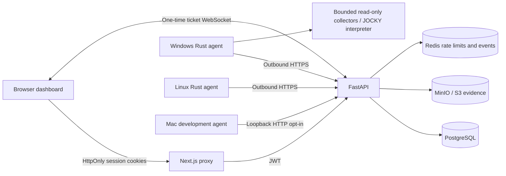

# Architecture

The browser never receives the endpoint credential. Enrollment exchanges a one-hour limited-use token for a unique credential; only its SHA-256 is stored in the database. During polling the API signs the exact job JSON using the credential presented on that authenticated connection. The agent verifies its signature, endpoint identity, expiration, kind, and script validation.

PostgreSQL is the job authority. Targets are claimed using row locks and SKIP LOCKED, with five-minute leases and three attempts. Result submission is idempotent for a target/lease. A cancelled target rejects subsequent results. Read-only recollection is allowed after a delivery failure.

Each result becomes a JSON evidence object in S3-compatible storage, plus normalized observation records and typed projections. Detectors run on those records. An immutable-style custody chain tracks object access. Native database triggers reject UPDATE and DELETE on audit and custody rows; a database administrator can still defeat this protection.

Redis carries ephemeral WebSocket events and rate-limit counters. Losing events does not lose evidence or jobs. Browser polling recovers views. Redis failure blocks API requests because rate limiting fails closed.

The Rust language pipeline is source → lexer → AST parser → semantic checks → bounded tree interpreter → safe collector APIs. No machine code or LLVM IR is produced. Compiler Lab compares serialization formats of an identical AST.

Reports are server-escaped HTML built from case attachments and current endpoint snapshots. Print to PDF is available through the browser. Report bytes are fingerprinted.
